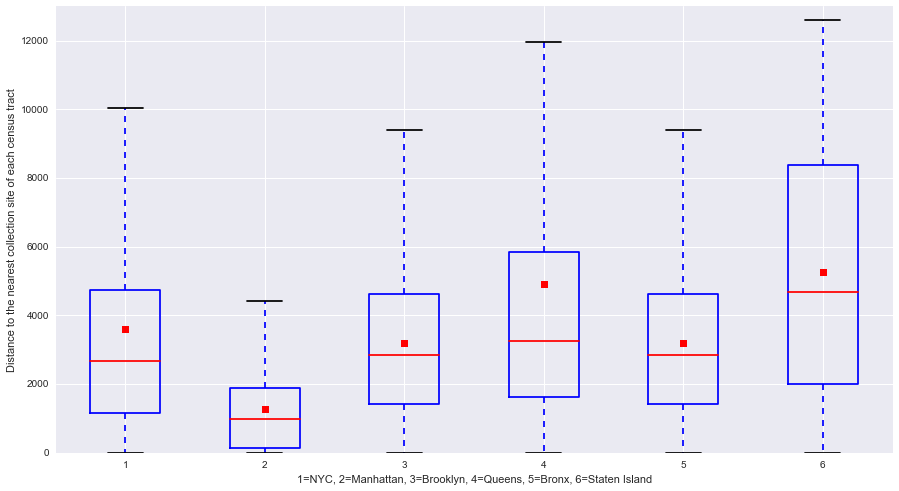

It’s pretty clear. I assume the red dot represents the mean of the distribution, but it’s unlabeled. It’s not misleading. The x axis tick marks could be better; I think labeling them as “NYC” would be better than “1”. Also, I assume distances are in feet, but it should probably say.

