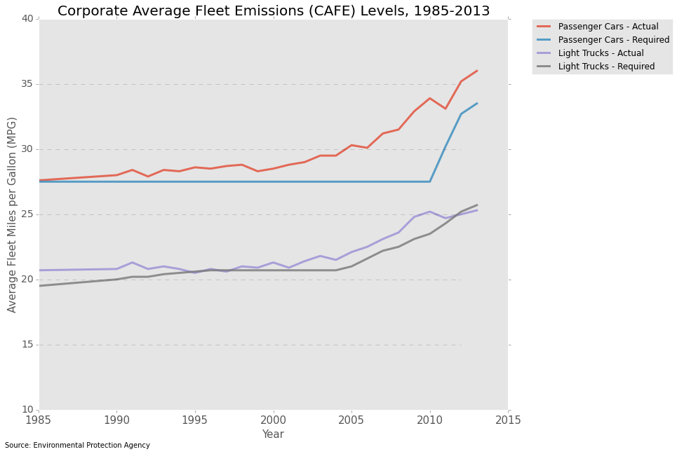

It’s clear and informative. I think the grey background is a little harder to read than white. Since the y axis goes from 10 to 40, I think it would be a good idea to start it at 0, because it’s close to 0 anyway, and it wouldn’t possible exaggerate changes in MPG.

