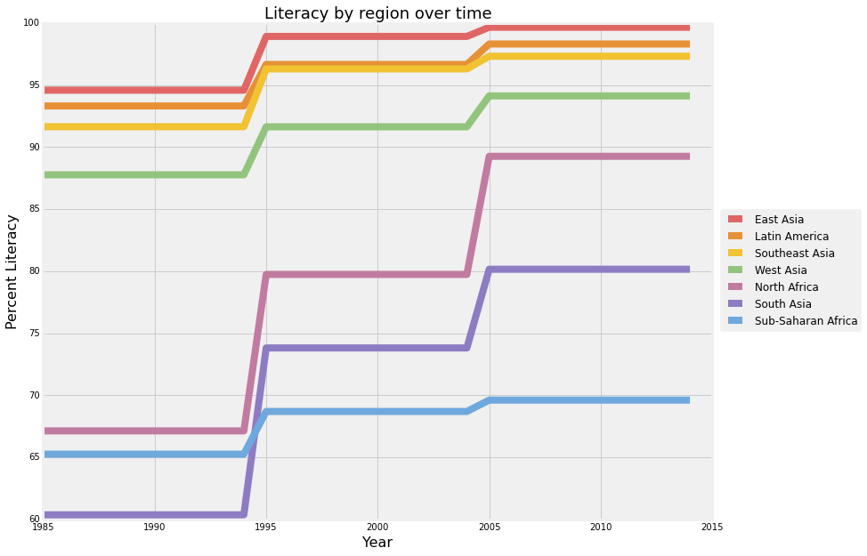

It looks good. It’s easy to understand. I think it makes sense to start the y axis at 60, because if it started at 0, it would be hard to see small changes. I think “Percent Literate” would be a better name for the y axis.

